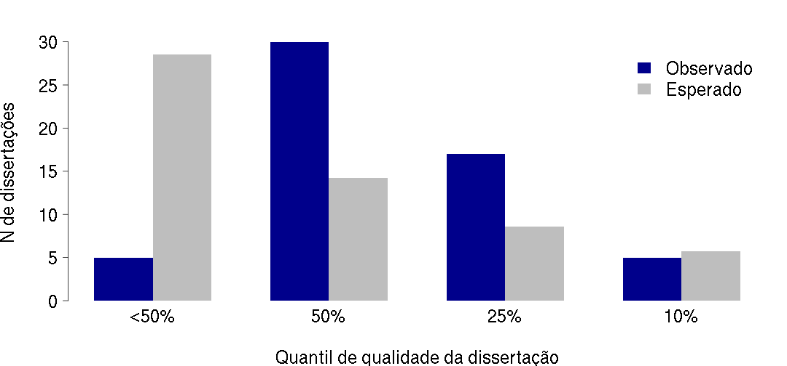
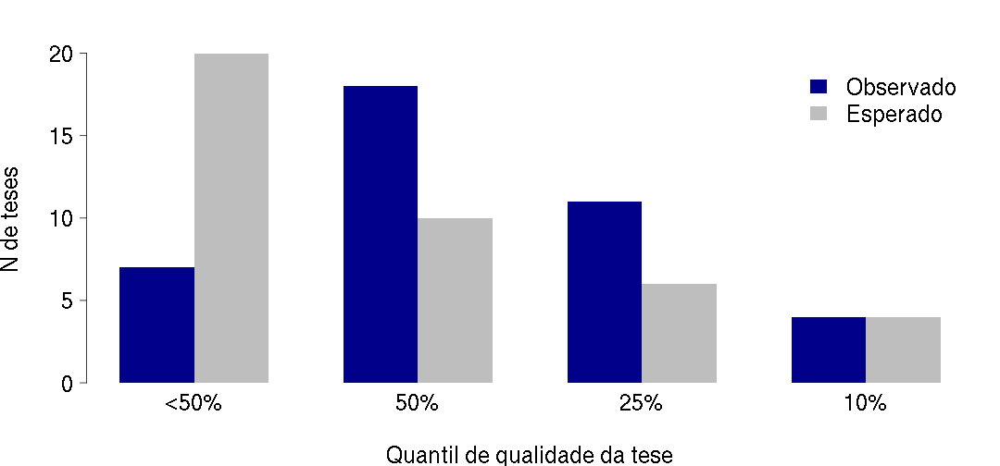
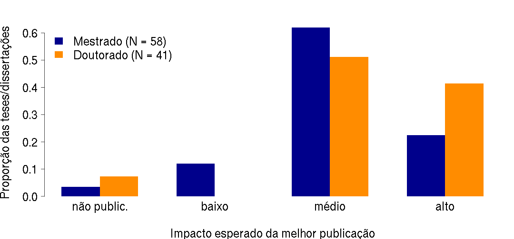
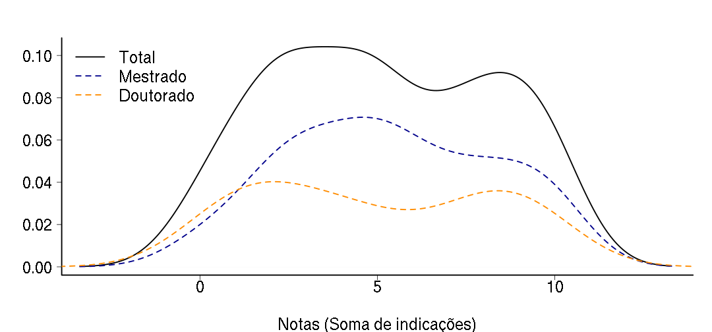
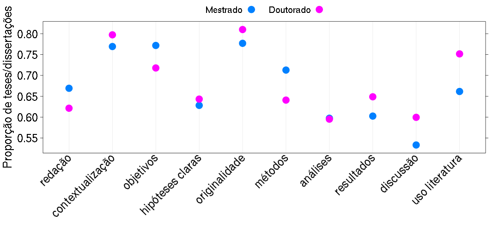
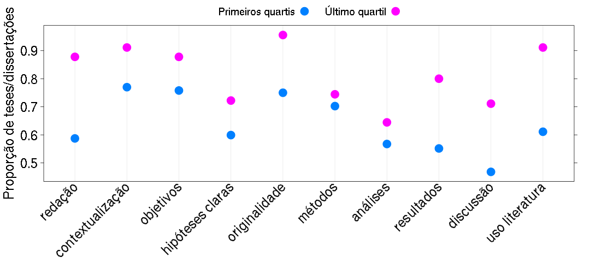
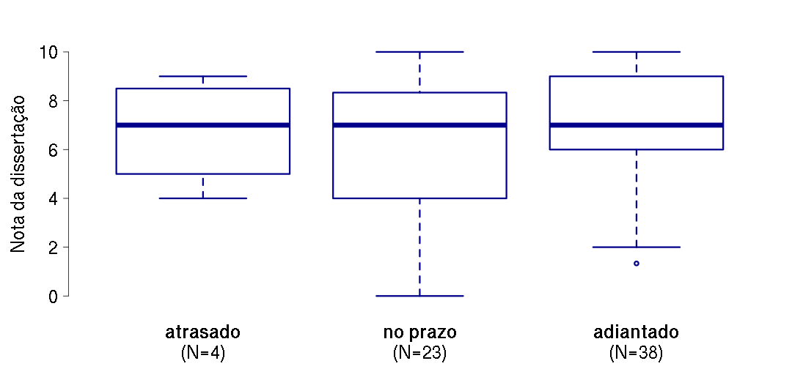
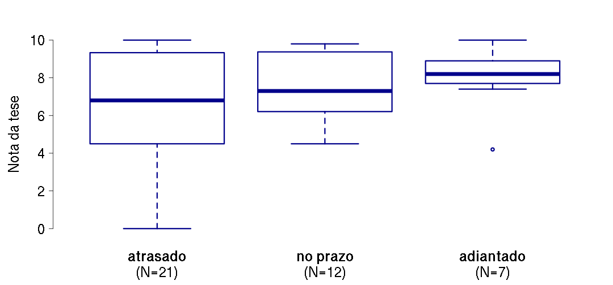

---

title       : Avaliação das teses e dissertações
subtitle    : Dados do Programa de Botânica
author      : Comissão de Pós-Graduação
job         : Instituto de Biociências da Universidade de São Paulo
widgets     : [bootstrap, interactive]# {mathjax, quiz, bootstrap}
framework   : io2012        # {deckjs, io2012, html5slides, shower, dzslides, ...}
hitheme: tomorrow
logo: logo_ib_transparente_small.png
biglogo: logo_ib_transparente.png
mode        : selfcontained # {standalone, draft}
assets: {js: 'test.js'}
url: {lib: ./libraries}
github:
  user: CPG-IBUSP
  repo: avaliacao-teses
 
---

## NAVEGAÇÃO:

 - Para menu de slides pressione 'o'
 - Para legenda dos gráficos pressione 'p'
 - [Página principal](../index.html)
 - [Resultados agregados](../geral/slides_geral.html)
 - Resultados dos outros programas:
   - [Ecologia](../ecologia/slides_ecologia.html)
   - [Fisiologia](../fisiologia/slides_fisiologia.html)
   - [Genética](../genetica/slides_genetica.html)
   - [Zoologia](../zoologia/slides_zoologia.html)

---

## Tamanho da amostra

### Defesas entre 2011 e 2015:

- Total: 107  
  - Mestrados: 65
  - Doutorados: 36
  - Doutorados diretos: 6

---

## Pergunta sobre qualidade relativa
Considerando o conjunto de dissertações e teses que você já avaliou e orientou, 
o presente trabalho enquadra-se: 
- Entre os 10% melhores.
- Entre os 25% melhores.
- Entre os 50% melhores.
- Abaixo dos 50% melhores

---

## Qualidade relativa - Mestrado

*** =pnotes

**Número de teses/dissertações defendidas entre
 2011 e 2015, por classe de qualidade.**

A avaliação anônima feita pelos participantes das bancas de defesa, 
que indicaram a qualidade do trabalho relativa a todos que 
já orientou ou avaliou, entre quatro classes:

- Abaixo dos 50% melhores que já avaliou/orientou
- Entre os 50% melhores
- Entre os 25% melhores
- Entre os 10% melhores

Quando houve resposta de mais de um avaliador, foi considerada 
a categoria de menor qualidade, entre as indicadas.

Também indicado o número esperado em cada categoria se o conjunto avaliado
e o já conhecido pela banca forem iguais em qualidade.

---

## Qualidade relativa - Doutorado

*** =pnotes

**Número de teses/dissertações defendidas entre
 2011 e 2015, por classe de qualidade.**

A avaliação anônima feita pelos participantes das bancas de defesa, 
que indicaram a qualidade do trabalho relativa a todos que 
já orientou ou avaliou, entre quatro classes:

- Abaixo dos 50% melhores que já avaliou/orientou
- Entre os 50% melhores
- Entre os 25% melhores
- Entre os 10% melhores

Quando houve resposta de mais de um avaliador, foi considerada 
a categoria de menor qualidade, entre as indicadas.

Também indicado o número esperado em cada categoria se o conjunto avaliado
e o já conhecido pela banca forem iguais em qualidade.

---

## Pergunta sobre impacto potencial

O melhor artigo decorrente da dissertação ou tese poderia ser
publicado em periódico em qual categoria de fator de impacto em sua
área:  
- Impacto alto
- Impacto médio
- Impacto baixo 
- Há baixa chance de publicação 

---

## Impacto potencial

*** =pnotes

**Proporção de teses e dissertações defendidas entre  2011 e 2015 , 
por classe de impacto.**

A avaliação anônima feita pelos participantes das bancas de defesa, 
que indicaram o impacto potencial da melhor publicação resultante da tese/dissertação, entre quatro classes:

- Há baixa chance de publicação 
- Impacto baixo 
- Impacto médio
- Impacto alto

Quando houve resposta de mais de um avaliador, foi considerada 
a categoria mais baixa entre as indicadas.

---

## Pergunta sobre itens de destaque
Quais dos quesitos a seguir o trabalho satisfaz de maneira muito
boa ou excelente? Não marque nenhuma opção caso nenhuma delas se
aplique ou marque mais de uma se achar adequado. 
- O texto é claro, conciso e com boa qualidade quanto a ortografia e gramática.
- O trabalho é bem contextualizado teoricamente.
- Os objetivos são bem definidos e condizentes com o título pleiteado.
- As perguntas e/ou hipóteses são claras e explicitamente apresentadas no texto.
- A idéia é original e traz uma contribuição teórica e/ou empírica relevante.

(continua)

---

## Pergunta itens de destaque (cont.)
Quais dos quesitos a seguir o trabalho satisfaz de maneira muito
boa ou excelente? Não marque nenhuma opção caso nenhuma delas se
aplique ou marque mais de uma se achar adequado. 

- Os métodos são bem descritos e adequados para responder à(s) pergunta(s).
- As análises são bem descritas e adequadas para responder à(s) pergunta(s).
- Os resultados são bem apresentados e respondem à(s) pergunta(s).
- A discussão é sólida e fortemente alicerçada nos resultados obtidos.
- A literatura citada é adequada e atualizada.

---

## Distribuição das notas

*** =pnotes

**Distribuição das notas das dissertações de mestrado e teses de doutorado 
defendidas no IBUSP  
( 2011 - 2015 ).**

A avaliação anônima feita pelos participantes das bancas de defesa, 
que indicaram até dez aspectos em que a tese/dissertação foi excelente ou muito boa: 
redação, contextualização teórica, objetivos bem definidos, pergunta/hipóteses claras, 
originalidade e relevância, métodos bem descritos e adequados, 
análises bem descritas e adequadas, 
resultados bem apresentados e conclusivos, discussão lógica e bem fundamentada, uso adequado da literatura.

As notas são as médias do número de indicações por tese/dissertação.
Quando houve avaliação por mais de um membro da banca usamos a menos nota.
As curvas são [kernels de densidade probabilística](http://en.wikipedia.org/wiki/Kernel_density_estimation), 
uma alternativa preferível a histogramas
para representar distribuições de frequência.

---

## Proporção de indicações por item

*** =pnotes

**Proporção de teses e dissertações consideradas excelentes em dez quesitos
( defesas entre 2011 e 2015 ).**

Avaliação anônima feita pelos participantes das bancas de defesa, 
que indicaram até dez aspectos em que a tese/dissertação foi excelente ou muito boa: 
redação, contextualização teórica, objetivos bem definidos, pergunta/hipóteses claras, 
originalidade e relevância, métodos bem descritos e adequados, 
análises bem descritas e adequadas, 
resultados bem apresentados e conclusivos, discussão lógica e bem fundamentada, uso adequado da literatura.

Para o cálculo das proporções, primeiro foram obtidas as médias de indicações de excelência  
em cada quesito, por aluno. Em seguida foi calculada a média desses valores para os mestrados e doutorados, para cada item.

---

## Quartis de qualidade (Mestrado)

***=pnotes

**Proporção de teses e dissertações consideradas excelentes em dez quesitos: 
comparação entre os melhores trabalhos e os demais. 
(Defesas entres 2011 e 2015 )**

Avaliação anônima feita pelos participantes das bancas de defesa, 
que indicaram até dez aspectos em que a tese/dissertação foi excelente ou muito boa 
(detalhes nos slides anteriores).
Para o cálculo das proporções, primeiro foram obtidas as médias de indicações de excelência  
em cada quesito, por aluno. Em seguida foi calculada a média desses valores para dois grupos:

- **Primeiros quartis**: abaixo dos 25% melhores trabalhos já avaliados pelo membro da banca;
- **Último quartil**: entre os 25% ou 10% melhores trabalhos já avaliados pelo membro da banca.

---

## Quartis de qualidade (Doutorado)

***=pnotes

**Proporção de teses e dissertações consideradas excelentes em dez quesitos: 
comparação entre os melhores trabalhos e os demais. 
(Defesas entres 2011 e 2015 )**

Avaliação anônima feita pelos participantes das bancas de defesa, 
que indicaram até dez aspectos em que a tese/dissertação foi excelente ou muito boa 
(detalhes nos slides anteriores).
Para o cálculo das proporções, primeiro foram obtidas as médias de indicações de excelência  
em cada quesito, por aluno. Em seguida foi calculada a média desses valores para dois grupos:

- **Primeiros quartis**: abaixo dos 25% melhores trabalhos já avaliados pelo membro da banca;
- **Último quartil**: entre os 25% ou 10% melhores trabalhos já avaliados pelo membro da banca.

---

## Prazo de depósito e nota (Mestrado)

***=pnotes

**Notas das dissertações e teses 
defendidas entre 2011 e 2015, em função do tempo de conclusão.**

Avaliação anônima feita pelos participantes das bancas de defesa, 
que indicaram até dez aspectos em que a tese/dissertação foi excelente ou muito boa 
(itens detalhados nos slides anteriores).
As notas são as médias do número de indicações por tese/dissertação, de três grupos:

- Atrasado: tese/dissertação depositada após mais de 30 dias do prazo regimental.
- No prazo: depositada entre 30 dias após a 10 dias antes do prazo.
- Adiantado: depósito com antecedência de mais de 10 dias do prazo.

Os atrasos devem-se a prorrogações e trancamentos, que  
ultrapassam os prazos regimentais. 

---

## Prazo de depósito e nota (Doutorado)

***=pnotes

**Notas das dissertações e teses 
defendidas entre 2011 e 2015, em função do tempo de conclusão.**

Avaliação anônima feita pelos participantes das bancas de defesa, 
que indicaram até dez aspectos em que a tese/dissertação foi excelente ou muito boa 
(itens detalhados nos slides anteriores).
As notas são as médias do número de indicações por tese/dissertação, de três grupos:

- Atrasado: tese/dissertação depositada após mais de 30 dias do prazo regimental.
- No prazo: depositada entre 30 dias após a 10 dias antes do prazo.
- Adiantado: depósito com antecedência de mais de 10 dias do prazo.

Os atrasos devem-se a prorrogações e trancamentos, que  
ultrapassam os prazos regimentais. 
