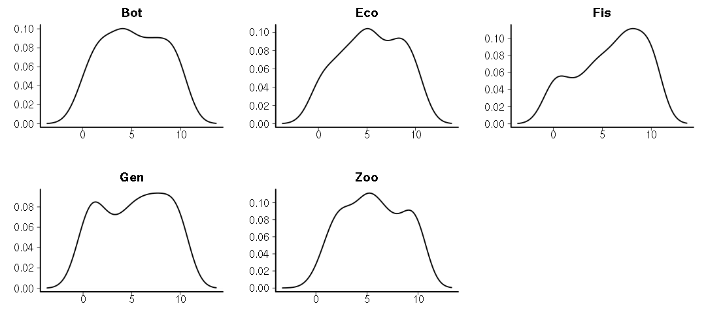
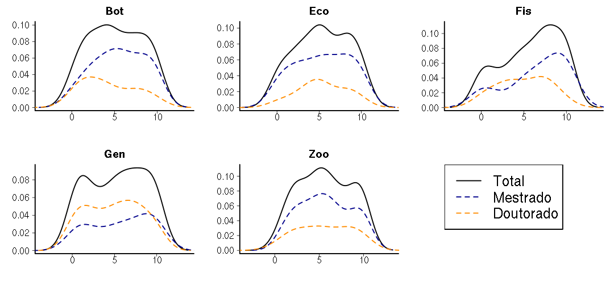

## Apresentação

---

## Metodologia
> - Ficha preenchida pela banca examinadora
> - Respostas anônimas
> - Três perguntas:
>   - Qualidade relativa às teses que avaliou/orientou
>   - Impacto potencial do melhor artigo
>   - Excelência em 10 quesitos

---

## Tamanho da amostra
### Defesas entre 2011 e 2013
<!-- Table generated in R 3.0.3 by googleVis 0.4.7 package -->
<!-- Wed Apr  9 01:46:27 2014 -->

<!-- jsHeader -->

 
<!-- jsChart -->  

 
<!-- divChart -->
  

---
## Qualidade relativa - Mestrado
 

---

## Qualidade relativa - Doutorado
 

---
## Impacto potencial
 

---
## Impacto potencial por programa
 

---
## Distribuição das notas
 

---
## Distribuição das notas por titulação
 

---
## Planilha de dados

- Download em formato [RData](./files/ficha.RData) (para R)
- Download em formato [csv](./files/ficha_avaliacao_CPG_IB.csv) (planilhas eletrônicas)
- [Metadados](./files/metadata.html)
