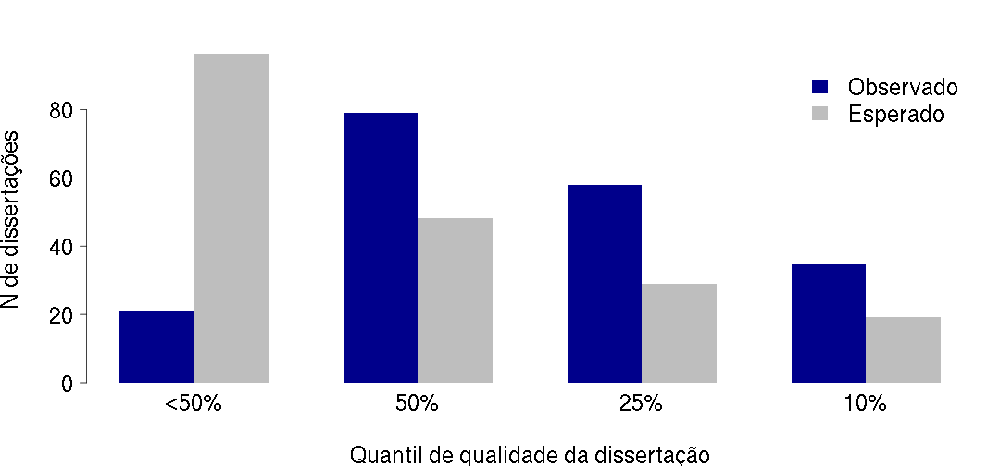
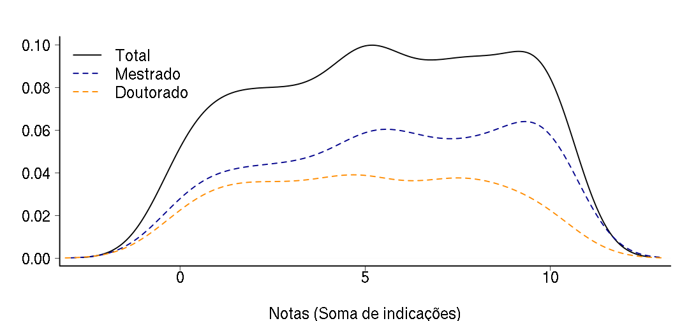
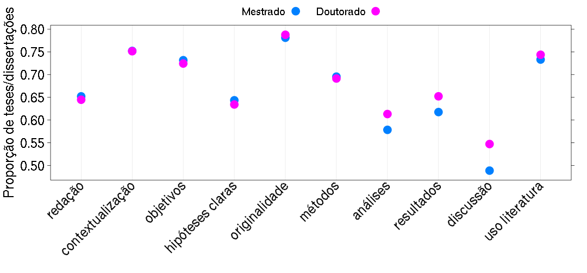
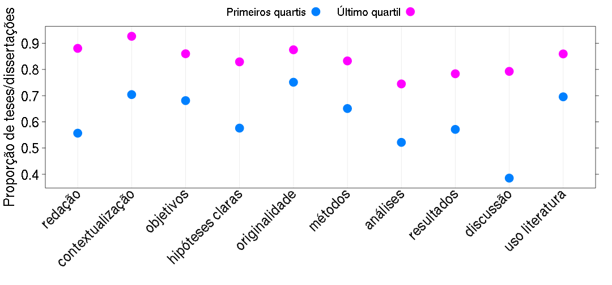
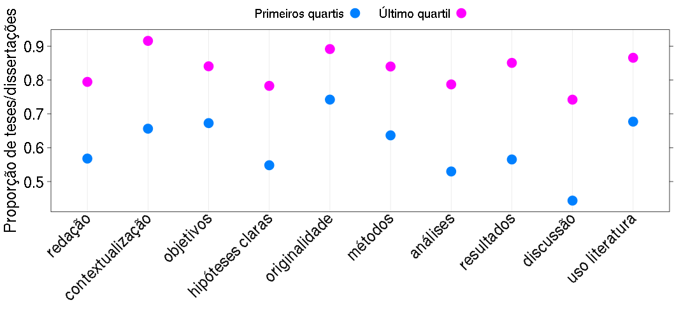
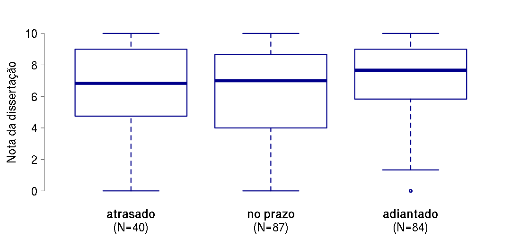
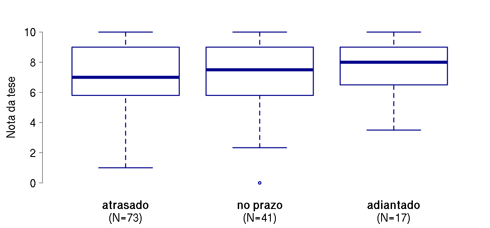

---

title       : Avaliação das tese e dissertações do IB-USP
subtitle    : Dados agregados de todos os programas
author      : Comissão de Pós-Graduação
job         : Instituto de Biociências da Universidade de São Paulo
framework   : deckjs        # {deckjs, io2012, html5slides, shower, dzslides, ...}
highlighter : highlight.js  # {highlight.js, prettify, highlight}
hitheme     : solarized_light      # 
widgets     : [bootstrap, quiz, shiny, interactive]# {mathjax, quiz, bootstrap}
mode        : selfcontained # {standalone, draft}
github:
  user: CPG-IBUSP
  repo: avaliacao-teses
 
---

## RESULTADOS AGREGADOS:

### Análises da ficha de avaliação de teses e dissertações, dados agregados de todos os programas do IB-USP.

#### Links
 - Para menu de slides pressione 'm'
 - [Página principal](index.html)
 - Resultados por programa:
   - [Botânica](slides_botanica.html)
   - [Ecologia](slides_ecologia.html)
   - [Fisiologia](slides_fisiologia.html)
   - [Genética](slides_genetica.html)
   - [Zoologia](slides_zoologia.html)

---

## Tamanho da amostra
### Defesas entre 2011 e 2013
<!-- Table generated in R 3.0.3 by googleVis 0.4.7 package -->
<!-- Thu Apr 10 02:51:40 2014 -->

<!-- jsHeader -->

 
<!-- jsChart -->  

 
<!-- divChart -->
  

---

## Pergunta sobre qualidade relativa
Considerando o conjunto de dissertações e teses que você já avaliou e orientou, 
o presente trabalho enquadra-se: 
- Entre os 10% melhores.
- Entre os 25% melhores.
- Entre os 50% melhores.
- Abaixo dos 50% melhores

---

## Qualidade relativa - Mestrado
 

---

## Qualidade relativa - Doutorado
 

---

## Pergunta sobre impacto potencial

O melhor artigo decorrente da dissertação ou tese poderia ser
publicado em periódico em qual categoria de fator de impacto em sua
área:  
- Impacto alto
- Impacto médio
- Impacto baixo 
- Há baixa chance de publicação 

---

## Impacto potencial
 

---

## Pergunta sobre itens de destaque
Quais dos quesitos a seguir o trabalho satisfaz de maneira muito
boa ou excelente? Não marque nenhuma opção caso nenhuma delas se
aplique ou marque mais de uma se achar adequado. 
- O texto é claro, conciso e com boa qualidade quanto a ortografia e gramática.
- O trabalho é bem contextualizado teoricamente.
- Os objetivos são bem definidos e condizentes com o título pleiteado.
- As perguntas e/ou hipóteses são claras e explicitamente apresentadas no texto.
- A idéia é original e traz uma contribuição teórica e/ou empírica relevante.

(continua)

---

## Pergunta itens de destaque (cont.)
Quais dos quesitos a seguir o trabalho satisfaz de maneira muito
boa ou excelente? Não marque nenhuma opção caso nenhuma delas se
aplique ou marque mais de uma se achar adequado. 

- Os métodos são bem descritos e adequados para responder à(s) pergunta(s).
- As análises são bem descritas e adequadas para responder à(s) pergunta(s).
- Os resultados são bem apresentados e respondem à(s) pergunta(s).
- A discussão é sólida e fortemente alicerçada nos resultados obtidos.
- A literatura citada é adequada e atualizada.

---

## Distribuição das notas
 

---

## Proporção de indicações por item
 

---

## Quartis de qualidade (Mestrado)

 

---

## Quartis de qualidade (Doutorado)

 

---

## Prazo de depósito e nota (Mestrado)
 

---

## Prazo de depósito e nota (Doutorado)
 

